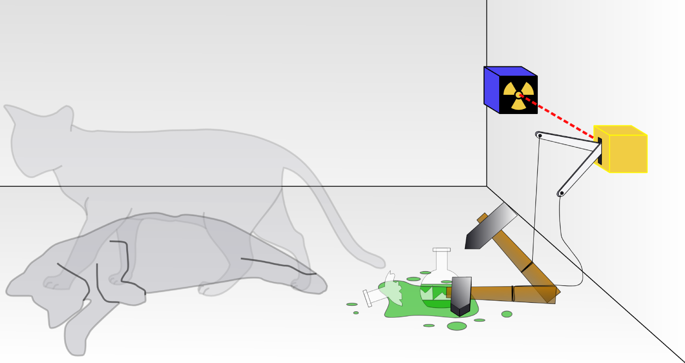

+++
title = "Introduction au quantique"
weight = 2
[params]
  author = 'Samuel Nepveu, Lucas Pomerleau'
+++

# Notes de cours — Ordinateur quantique

## Introduction


Les ordinateurs quantiques représentent une révolution dans le traitement de l'information. Contrairement aux ordinateurs classiques qui manipulent des bits (0 ou 1), les ordinateurs quantiques exploitent les propriétés étranges de la mécanique quantique pour effectuer des calculs d'une manière fondamentalement différente. Cette technologie promet de résoudre certains problèmes considérés comme impossibles pour nos ordinateurs actuels.

## 1. Le qubit : l'unité de base de l'information quantique

### Différence avec un bit classique

Un **bit classique** ne peut exister que dans deux états distincts : 0 ou 1. C'est comme un interrupteur qui est soit éteint, soit allumé. Dans la mémoire de votre ordinateur, ces états sont représentés par des tensions électriques différentes.

Un **qubit** (bit quantique), quant à lui, peut exister dans une superposition de ces deux états simultanément. Imaginez un qubit comme une pièce de monnaie qui tournoie dans les airs : avant de retomber, elle n'est ni pile ni face, mais les deux à la fois. C'est cette propriété qui donne aux ordinateurs quantiques leur puissance.

### Représentation mathématique

En notation mathématique, l'état d'un qubit s'écrit :


$$|\psi\rangle = \alpha|0\rangle + \beta|1\rangle$$


Cette équation mérite quelques explications :

- **$|\psi\rangle$** représente l'état quantique du qubit (le symbole $|\cdot\rangle$ est appelé "notation de Dirac" ou "ket")
- **$|0\rangle$** et **$|1\rangle$** sont les deux états de base possibles (équivalents au 0 et 1 classiques)
- **$\alpha$** et **$\beta$** sont des **nombres complexes** appelés **amplitudes de probabilité**
- Ces amplitudes déterminent la probabilité de mesurer le qubit dans chaque état :
  - Probabilité d'obtenir 0 lors de la mesure : $|\alpha|^2$
  - Probabilité d'obtenir 1 lors de la mesure : $|\beta|^2$
- La contrainte fondamentale : $|\alpha|^2 + |\beta|^2 = 1$ (la somme des probabilités doit égaler 100%)

**Exemple concret :** Si $\alpha = \frac{1}{\sqrt{2}}$ et $\beta = \frac{1}{\sqrt{2}}$, alors :
- Probabilité de mesurer 0 : $|\frac{1}{\sqrt{2}}|^2 = \frac{1}{2}$ (50%)
- Probabilité de mesurer 1 : $|\frac{1}{\sqrt{2}}|^2 = \frac{1}{2}$ (50%)

Le qubit est donc dans une superposition parfaitement équilibrée entre 0 et 1.

### Visualisation : la sphère de Bloch


Pour visualiser un qubit, on utilise la **sphère de Bloch**. Cette représentation géométrique montre l'état du qubit comme un point sur la surface d'une sphère :

- Le pôle nord représente l'état $|0\rangle$
- Le pôle sud représente l'état $|1\rangle$
- Tous les autres points sur la sphère représentent des superpositions possibles

La sphère elle‑même est un repère fixe: son orientation ne change pas. Ce qui bouge, c'est l'« aiguille » qui pointe vers l'état du qubit. Les portes quantiques font tourner cette aiguille autour d'un axe (X, Y ou Z), sans faire pivoter la sphère.

> [!tip] **Outils interactifs**
> Pour mieux comprendre et visualiser comment les portes quantiques manipulent la sphère de Bloch, vous pouvez utiliser ce simulateur interactif : [Bloch Sphere Simulator](https://bits-and-electrons.github.io/bloch-sphere-simulator/)
> 
> La ligne grise correspond à la direction de votre "aiguille".

## 2. La superposition quantique

### Qu'est-ce que la superposition ?

La **superposition** est le principe qui permet à un qubit d'exister dans plusieurs états simultanément jusqu'à ce qu'il soit mesuré. C'est une propriété fondamentale qui n'existe pas dans le monde classique à notre échelle.

Prenons un exemple concret : si vous avez 3 qubits en superposition, ils peuvent représenter simultanément les 8 combinaisons possibles (000, 001, 010, 011, 100, 101, 110, 111). Avec 3 bits classiques, vous ne pourriez représenter qu'une seule de ces combinaisons à la fois.

Cette propriété est essentielle car elle permet à un ordinateur quantique d'explorer plusieurs solutions en parallèle. C'est comme si vous pouviez tester tous les chemins d'un labyrinthe en même temps plutôt que d'explorer chaque chemin l'un après l'autre.

> [!tip] **Le chat de Schrödinger**
> Une célèbre pensée expérience illustre la superposition : imaginez un chat enfermé dans une boîte hermétique avec un mécanisme aléatoire qui libère du poison ou ne libère rien. Tant que la boîte est fermée, vous ne savez pas ce qui s'est passé. Du point de vue quantique, le système existe dans une superposition des deux états possibles. Par conséquent, le chat est **à la fois vivant ET mort** (en superposition).
>
> **L'instant où vous ouvrez la boîte :** Dès que vous regardez à l'intérieur, la superposition s'effondre. Le chat devient définitivement vivant *ou* mort.
>
> **Le parallèle avec les qubits :** De la même manière, un qubit existe dans tous les états possibles (superposition) jusqu'à sa mesure. Dès que nous le mesurons, le qubit devient définitivement 0 *ou* 1. C'est pourquoi on ne peut pas "regarder" l'état d'un qubit sans le modifier irrémédiablement.



## 3. L'intrication quantique

### Le phénomène d'intrication

L'**intrication** est probablement la propriété la plus mystérieuse de la mécanique quantique. Lorsque deux qubits sont intriqués, l'état de l'un est instantanément corrélé à l'état de l'autre, quelle que soit la distance qui les sépare. Si vous mesurez un qubit intriqué et obtenez 0, vous savez instantanément que l'autre qubit donnera 1 (ou vice versa, selon le type d'intrication).

### Utilité en informatique quantique

L'intrication permet de créer des corrélations impossibles à reproduire avec des bits classiques. Ces corrélations sont exploitées dans :

#### Les algorithmes quantiques

L'intrication permet de **coordonner** le traitement de l'information entre plusieurs qubits. Lorsque des qubits sont intriqués, une opération sur l'un d'eux affecte instantanément l'état des autres. 

**Exemple concret :** Dans l'algorithme de Grover (recherche dans une base de données), on crée d'abord une superposition de toutes les solutions possibles, puis on utilise l'intrication pour faire "communiquer" les qubits entre eux. Cette communication permet de renforcer progressivement la probabilité de la bonne réponse tout en diminuant celle des mauvaises réponses, comme si tous les qubits "votaient" ensemble pour trouver la solution.

#### La cryptographie quantique

L'intrication permet de **détecter toute tentative d'écoute** sur une communication. Le principe repose sur le fait que mesurer un qubit détruit son état quantique.

**Comment ça marche :**
1. Alice et Bob créent une paire de qubits intriqués
2. Alice garde un qubit, Bob garde l'autre
3. Si un espion (Eve) tente d'intercepter et mesurer le qubit, l'intrication est brisée
4. Alice et Bob peuvent détecter cette perturbation en comparant une partie de leurs mesures
5. Si l'intrication est intacte, ils savent que personne n'a écouté et peuvent utiliser leurs mesures pour créer une clé de chiffrement sécurisée

C'est le principe du **protocole BB84** et de la **distribution quantique de clés (QKD)**.

#### La téléportation quantique

L'intrication permet de **transférer l'état d'un qubit** vers un autre sans transmission physique de la particule elle-même.

**Comment ça fonctionne :**
1. Alice veut envoyer l'état d'un qubit à Bob
2. Ils partagent au préalable une paire de qubits intriqués
3. Alice effectue une mesure conjointe sur son qubit intriqué et le qubit à téléporter
4. Alice envoie le résultat de sa mesure à Bob par un canal classique (téléphone, internet...)
5. En fonction de ce résultat, Bob applique une correction sur son qubit intriqué
6. Le qubit de Bob se trouve maintenant dans l'état exact du qubit original d'Alice

>[!warning]  Attention
> Le qubit original d'Alice est détruit dans le processus (on ne peut pas cloner un état quantique). On ne transmet pas de matière ni d'énergie, seulement de l'information quantique. Et on a toujours besoin d'un canal classique, donc pas de communication plus rapide que la lumière !

## 4. Les interférences quantiques

### Le contrôle de la phase

Les interférences quantiques sont au cœur du fonctionnement des algorithmes quantiques. Chaque amplitude de probabilité ($\alpha$ et $\beta$) possède une **phase**, qui peut être visualisée comme un angle dans le plan complexe.

En contrôlant précisément ces phases, on peut faire **interférer** les différents chemins de calcul :
- **Interférence constructive** : augmente la probabilité d'obtenir les bonnes réponses
- **Interférence destructive** : diminue la probabilité d'obtenir les mauvaises réponses

C'est très similaire à la manière dont l'annulation active du bruit fonctionne. On ajuste les ondes sonores pour créer du silence à certains endroits (interférence destructive) et amplifie le son à d'autres (interférence constructive).


### Application pratique

Dans un algorithme quantique bien conçu, les interférences sont orchestrées pour que :
1. Les chemins menant vers la solution correcte se renforcent mutuellement
2. Les chemins menant vers de mauvaises réponses s'annulent

Cette manipulation subtile des phases est ce qui permet aux ordinateurs quantiques de résoudre efficacement certains problèmes.

## 5. La mesure quantique

### Le processus de mesure

La **mesure** est l'acte de lire l'information contenue dans un qubit. C'est à ce moment que la superposition s'effondre : le qubit choisit un état définitif (0 ou 1) selon les probabilités dictées par ses amplitudes.

Concrètement, pour mesurer un qubit, on utilise des dispositifs physiques spécifiques selon la technologie :
- Pour les qubits supraconducteurs : on envoie un signal micro-onde et on détecte la réponse
- Pour les ions piégés : on illumine l'ion avec un laser et on observe s'il fluoresce

### Conséquences de la mesure

Une fois mesuré, un qubit perd sa superposition et devient un bit classique. C'est pourquoi on ne peut pas simplement "lire" tous les calculs effectués en parallèle : la mesure détruit l'information quantique.

Cette limitation force les concepteurs d'algorithmes quantiques à être ingénieux dans la façon dont ils extraient les résultats. On ne peut mesurer qu'une seule fois, et il faut que cette mesure révèle la solution recherchée avec une probabilité élevée.

### Principe de répétition

Pour obtenir un résultat fiable, les algorithmes quantiques sont souvent répétés plusieurs fois. Si l'algorithme est bien conçu, la bonne réponse apparaîtra statistiquement plus souvent que les mauvaises réponses. C'est pour cette raison que les ordinateurs quantiques ne donnent pas toujours des réponses exactes, mais des réponses probables avec un certain niveau de confiance.

## 6. Les opérations quantiques (portes logiques)

Tout comme les ordinateurs classiques utilisent des portes logiques (AND, OR, NOT) pour manipuler les bits, les ordinateurs quantiques utilisent des **portes quantiques** pour manipuler les qubits. Voici les principales portes utilisées :

### Porte Hadamard (H)

La porte Hadamard est l'opération de base pour créer une **superposition**. Elle transforme un état défini en une superposition égale de 0 et 1.

**Fonctionnement :**
- Si on applique H à un qubit dans l'état $|0\rangle$, il devient : $\frac{1}{\sqrt{2}}(|0\rangle + |1\rangle)$ (50% de chance de mesurer 0 ou 1)
- Si on applique H à un qubit dans l'état $|1\rangle$, il devient : $\frac{1}{\sqrt{2}}(|0\rangle - |1\rangle)$

**Applications pratiques :**
- Point de départ de presque tous les algorithmes quantiques
- Utilisée dans la cryptographie quantique pour générer des états aléatoires

### Portes de Pauli (X, Y, Z)

Ces trois portes sont analogues aux rotations dans l'espace tridimensionnel sur la sphère de Bloch :

**Porte X (NOT quantique) :**
- Fait pencher l'aiguille vers l'avant/l'arrière
- C'est l'équivalent d'un bit flip dans un ordinateur classique

> [!note] **Note sur la nomenclature**
> Il peut sembler contre-intuitif que la porte X affecte l'axe Y visuel de la sphère de Bloch. Cela s'explique par le choix des conventions mathématiques : les portes X, Y, Z ne correspondent pas directement aux axes X, Y, Z de la sphère, mais plutôt aux rotations autour de ces axes. Une rotation autour de l'axe X fait basculer l'aiguille le long de l'axe Y. 

**Porte Y :**
- Fait pencher l'aiguille vers la gauche ou la droite

**Porte Z :**
- Fait tourner l'aiguille comme sur un toupie 

### Porte CNOT (Controlled-NOT)

La porte CNOT est une porte à **deux qubits** qui crée de l'**intrication**.

**Fonctionnement :**
- Elle a un qubit de contrôle et un qubit cible
- Si le qubit de contrôle est dans l'état $|1\rangle$, la porte X est appliquée sur le qubit cible
- Si le qubit de contrôle est dans l'état $|0\rangle$, rien ne se passe

**Applications :**
- Algorithmes de correction d'erreurs quantiques
- Indispensable dans presque tous les circuits quantiques complexes

### Porte T (Phase Gate)

La porte T ajoute une **phase** précise au qubit.

**Fonctionnement :**
- L'état $|0\rangle$ reste inchangé
- L'état $|1\rangle$ acquiert une phase de $\frac{\pi}{4}$

> [!note] **Note sur les détails**
> Les détails de comment la porte change la phase n'est pas important dans le cadre de ce cours, l'important est simplement de savoir que la porte T est ce qu'il permet de changer les probabilités qu'un qubit tombe sur un état plutôt qu'un autre.  

**Applications :**
- Contrôle fin des interférences quantiques
- Essentielle pour obtenir l'universalité quantique (capacité à implémenter n'importe quel algorithme)
- Utilisée dans les algorithmes de factorisation comme Shor

### Porte SWAP

La porte SWAP **échange les états** de deux qubits.

**Applications :**
- Déplacement d'information entre qubits éloignés dans un circuit
- Optimisation de la topologie des circuits quantiques
- Simulation de systèmes physiques

Ça serait l'équivalent de ceci en javascript.

```javascript
function swap(a, b) {
    let temp = a;
    a = b;
    b = temp;
    return [a, b];
}
```

## 7. La puissance du calcul quantique

### Le principe du parallélisme quantique

La force des ordinateurs quantiques réside dans leur capacité à exploiter $n$ qubits pour représenter $2^n$ états simultanément en superposition.

**Exemples concrets :**
- 3 qubits = 8 états ($2^3$)
- 10 qubits = 1 024 états ($2^{10}$)
- 50 qubits = 1 125 899 906 842 624 états (plus d'un quadrillion)
- 300 qubits = plus d'états que d'atomes dans l'univers observable !

Cette croissance exponentielle permet d'explorer un espace de solutions gigantesque en parallèle, ce qui est impossible pour un ordinateur classique qui doit examiner chaque possibilité séquentiellement.

Un exemple célèbre est l'**algorithme de Grover**, qui permet de rechercher une entrée spécifique dans une base de données non triée en seulement $\sqrt{N}$ opérations, contre $N$ opérations pour un ordinateur classique. Pour une base de données de 1 million d'entrées, un ordinateur quantique pourrait trouver la bonne entrée en environ 1 000 opérations, tandis qu'un ordinateur classique en nécessiterait 1 million.

## 8. Les défis actuels de l'informatique quantique

### La décohérence quantique

Le problème majeur des ordinateurs quantiques est que les **qubits perdent très facilement leur état quantique**. Ce phénomène s'appelle la **décohérence**.

**Causes de la décohérence :**
- Interactions avec l'environnement (vibrations, champs électromagnétiques)
- Variations de température
- Imperfections des matériaux

**Solutions actuelles :**
- **Refroidissement extrême** : Les processeurs quantiques sont refroidis à des températures proches du zéro absolu (-273,15°C ou 0 Kelvin)
- **Isolation** : Les qubits sont placés dans des chambres à vide ultra-poussé (la moindre particule peut perturber l'état quantique)
- **Durée de cohérence limitée** : Les calculs doivent être effectués en quelques microsecondes avant que les qubits ne perdent leur état

### L'état de la recherche actuelle

**Nombre de qubits :**
- Les systèmes actuels varient de 20 à 1000 qubits
- IBM propose des systèmes de 127 qubits accessibles via le cloud
- Google a démontré la "suprématie quantique" avec 53 qubits en 2019 (résolution d'un problème spécifique plus rapidement qu'un superordinateur classique)

**Qualité des qubits :**
- Les qubits actuels sont **bruyants** : ils produisent beaucoup d'erreurs
- Pas encore de **correction d'erreurs** efficace à grande échelle
- Les algorithmes doivent être conçus pour tolérer un certain taux d'erreur

**Capacités réelles :**
- Pas encore capable de **casser RSA** ni d'autres algorithmes de chiffrement largement utilisés
- Les applications pratiques restent limitées à des problèmes spécifiques

## 9. L'impact futur de l'informatique quantique

### Domaines d'application prometteurs

**Cryptographie :**
- **Menace** : L'algorithme de Shor pourrait casser RSA, ECC et autres systèmes de chiffrement actuels
- **Solution** : Développement de la **cryptographie post-quantique** résistante aux attaques quantiques
- Le NIST (National Institute of Standards and Technology) a publié des standards d'algorithmes "quantum-proof" en 2024

**Simulation moléculaire et chimie :**
- Conception de nouveaux médicaments par simulation de molécules complexes
- Développement de batteries plus efficaces
- Création de catalyseurs pour capturer le CO₂

**Optimisation :**
- Logistique et gestion de chaînes d'approvisionnement
- Optimisation de portefeuilles financiers
- Planification de routes pour véhicules autonomes

**Intelligence artificielle :**
- Accélération de l'entraînement des modèles d'apprentissage automatique
- Amélioration de la reconnaissance de patterns
- Optimisation des réseaux de neurones

### Préparation à l'ère quantique

**Pour les organisations :**
- Cataloguer les systèmes utilisant des algorithmes de chiffrement vulnérables
- Planifier une migration vers des algorithmes post-quantiques
- Former les équipes aux concepts quantiques

**Pour les développeurs :**
- Se familiariser avec les langages de programmation quantique (Q#, Qiskit, Cirq)
- Comprendre les principes fondamentaux de l'informatique quantique
- Suivre l'évolution des standards de sécurité

---

## Conclusion

L'informatique quantique représente un changement de paradigme majeur dans notre façon de traiter l'information. Bien que nous soyons encore aux premiers stades de cette technologie, les progrès sont rapides et prometteurs. Les prochaines années verront probablement l'émergence des premières applications pratiques qui transformeront des domaines aussi variés que la médecine, la finance, et la cybersécurité.

Pour les étudiants en informatique d'aujourd'hui, comprendre les bases de l'informatique quantique devient aussi essentiel que la maîtrise des algorithmes classiques. Cette technologie façonnera l'avenir de notre domaine et créera de nouvelles opportunités de carrière passionnantes.
