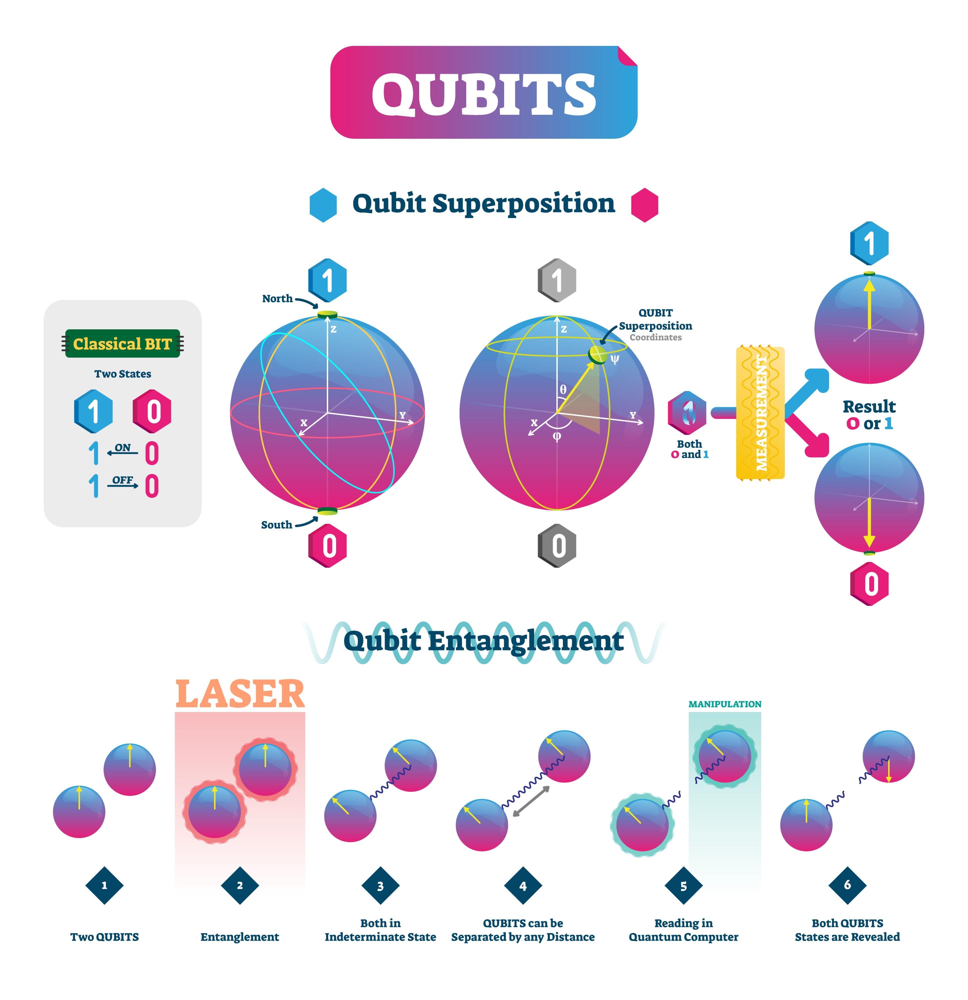

+++
title = "Veille technologique"
weight = 1
[params]
  author = 'Samuel Nepveu, Lucas Pomerleau & Colin Leblanc'
+++

# Veille technologique

## 1. Premier prompt et réponse d’un LLM

**Prompt utilisé avec ChatGPT-4.1 :**  
*Explique-moi simplement ce qu’est un ordinateur quantique : comment ils fonctionnent, leurs différences avec les ordinateurs classiques, leurs applications actuelles et leurs limitations.*

**Réponse du LLM :**  
Un ordinateur quantique est un type d’ordinateur qui utilise les principes de la mécanique quantique pour traiter l’information. Contrairement aux ordinateurs classiques qui utilisent des bits (0 ou 1), les ordinateurs quantiques utilisent des qubits, qui peuvent être dans plusieurs états à la fois grâce à la superposition. Cela leur permet de résoudre certains problèmes beaucoup plus rapidement, comme la factorisation de grands nombres ou la simulation de molécules complexes. Les applications principales incluent la cryptographie, la recherche pharmaceutique, l’optimisation et l’intelligence artificielle. Les défis actuels sont la stabilité des qubits (décohérence), la correction d’erreurs, la mise à l’échelle des machines et le coût de fabrication.

### 2. Discussion de la réponse

La réponse du LLM est très bonne : elle explique les bases du fonctionnement des ordinateurs quantiques, leurs différences avec les ordinateurs classiques, leurs applications et leurs limitations. Cependant, elle reste assez générale et n’aborde pas certains points plus spécifiques comme l’intrication quantique ou des exemples d’algorithmes spécifiques (ex. : Shor, Grover).

#### Analyse factuelle

- **Différences classiques vs quantiques**  
  L’analyse du LLM est correcte. Un ordinateur quantique fonctionne différemment d’un ordinateur classique : là où le second utilise des bits (0 ou 1), les ordinateurs quantiques utilisent des qubits, qui peuvent être dans plusieurs états à la fois. Ce fait est largement reconnu par la communauté scientifique.  
  [Wikipedia - Ordinateur quantique](https://fr.wikipedia.org/wiki/Ordinateur_quantique)

- **Avantages et applications**  
  Le LLM affirme que les méthodes issues de la mécanique quantique permettent aux ordinateurs quantiques de résoudre certains problèmes beaucoup plus rapidement, notamment la factorisation de grands nombres, la cryptographie, l’optimisation et l’intelligence artificielle. 

  Cette analyse est correcte, mais elle ne dit pas toute la vérité. En théorie, les avantages sont immenses, mais en pratique, nous sommes encore loin d’obtenir un réel avantage. IBM parle d’« avantage quantique », c’est-à-dire qu’un système quantique peut fournir une meilleure solution, plus rapide ou moins coûteuse que toutes les méthodes classiques connues. Or, "IBM estime que les premiers avantages quantiques pourraient être atteints d’ici la fin de 2026, à condition que les communautés du quantique et du calcul haute performance collaborent étroitement." [IBM - Qu'est-ce que l'informatique quantique](https://www.ibm.com/fr-fr/think/topics/quantum-computing)  

  Un autre avantage théorique des ordinateurs quantiques est la certitude ainsi que la précision des calculs effectués, mais selon Polytechnique Paris, nous sommes encore loin de ce réel avantage car pour se faire, nous devrions utiliser une technique qui consiste à utiliser un grand nombre de qubits pour créer un « qubit logique ». Toutefois, "Selon les experts, un véritable « avantage », ou « suprématie » quantique ne pourra être atteint que lorsque les ordinateurs quantiques fonctionneront avec un million de qubits. Et comme le record actuel est encore inférieur à 100 qubits, il reste encore beaucoup de chemin à parcourir." [Polytechnique Insights](https://www.polytechnique-insights.com/tribunes/science/lordinateur-quantique-tout-comprendre-en-15-minutes/)

- **Défis et limitations**  
  Le LLM mentionne la stabilité des qubits, la correction d’erreurs, la mise à l’échelle et le coût. En effet, plusieurs sources confirment que le taux d’erreurs est très élevé :  
  > « Or, aujourd’hui, au mieux, une opération sur 1 000 se révèle erronée. »  
  [Inria - Informatique quantique](https://www.inria.fr/fr/informatique-quantique-algorithme-optimisation-multiobjectifs)
  
  Le LLM affirme également quelques autres défis qui sont tout à fait légitimes, tels que le coût de fabrication et les contraintes d'installation et d'entreposage de ce genre d'appareil.

### 3. Comparaison avec GEMINI 3

Gemini propose une analyse plus structurée, débutant par une mise en contexte :  
Un ordinateur quantique n'est pas seulement un ordinateur plus rapide ; c'est une machine qui utilise les lois de la physique quantique (la science de l'infiniment petit) pour calculer. Il permet de traiter simultanément un nombre astronomique de possibilités, ce qui le rend potentiellement capable de résoudre des problèmes qui sont actuellement impossibles, même pour les supercalculateurs les plus puissants.

#### 1. Comment fonctionnent-ils ? Le secret des Qubits
   - **Le Qubit (Bit Quantique)** : C'est l'unité d'information. Contrairement au bit classique qui est soit un 0 soit un 1, le qubit exploite le principe de superposition. Cela signifie qu'il peut être 0 et 1 en même temps. Imaginez une pièce de monnaie qui tourne en l'air : tant qu'elle tourne, elle est à la fois Pile et Face.
  - **La Superposition** : Grâce à la superposition, un ordinateur quantique avec seulement quelques centaines de qubits peut représenter plus d'informations que tous les bits de tous les ordinateurs classiques réunis. Il peut ainsi explorer toutes les solutions d'un problème simultanément.
  - **L'Intrication** : C'est le deuxième pilier. Si deux qubits sont intriqués, ils sont liés de manière spéciale : mesurer l'état de l'un vous donne instantanément l'état de l'autre, peu importe la distance. C'est ce qui permet une coordination massive des calculs.

  
  *(Image fournit par Gemini)*

#### 2. Différences avec les ordinateurs classiques

La différence fondamentale réside dans la manière de traiter l'information :

   | Caractéristique      | Ordinateur Classique | Ordinateur Quantique         |
   |----------------------|----------------------|------------------------------|
   | Unité de base        | Bit (0 ou 1)         | Qubit (0 et 1 simultanément) |
   | Méthode de calcul    | Séquentielle         | Massivement parallèle        |
   | Rôle                 | Calculs quotidiens   | Problèmes complexes          |
   | Environnement        | Température ambiante | Extrêmement froid            |

#### 3. Applications actuelles et futures

Ces machines ne sont pas destinées à remplacer votre PC, mais à résoudre des problèmes spécifiques dans des domaines où les milliards de variables paralysent les machines classiques.
   - **Chimie & Matériaux** : Simulation moléculaire pour concevoir de nouveaux médicaments ou matériaux.
   - **Optimisation** : Logistique, finance, gestion du trafic.
   - **Intelligence artificielle** : Accélérer l’apprentissage machine.
   - **Cybersécurité** : Briser les méthodes de chiffrement actuelles (d’où la cryptographie post-quantique).

   ---

#### 4. Les Limitations actuelles  
  - **La Fragilité (Décohérence)** : Les qubits sont incroyablement sensibles. La moindre perturbation (bruit, chaleur, vibration) fait perdre au qubit son état quantique (la pièce qui tourne tombe). C'est le principal obstacle.

  - **Les Conditions Extrêmes** : Pour maintenir la cohérence des qubits, la plupart des systèmes nécessitent une infrastructure cryogénique (un réfrigérateur géant) maintenant le processeur à des températures avoisinant -273 °C.

  - **Le Taux d'Erreur** : Les calculs quantiques sont truffés d'erreurs dues à la décohérence. Les chercheurs doivent utiliser de nombreux qubits pour le contrôle d'erreur, ce qui limite le nombre de qubits réellement utilisables pour le calcul (les qubits logiques).

  - **Nombre de Qubits Limité** : Les machines actuelles ne disposent pas encore du nombre de qubits stables et fiables nécessaires pour surpasser les ordinateurs classiques sur des applications pratiques à grande échelle.

### 4. Analyse de la réponse de Gemini

L’analyse de Gemini est plus approfondie : elle inclut des images, des statistiques, des comparaisons et aborde l’intrication, un phénomène clé de la mécanique quantique. Ce point manque dans la réponse de ChatGPT.  
*À noter : la version Pro de ChatGPT peut offrir une analyse plus détaillée. La version Pro de Gemini a été utilisé*

## En résumé

Les réponses des LLM sont de bonnes synthèses pour débuter, mais elles gagneraient à être complétées par des exemples concrets et des liens vers des sources de qualité. Les moteurs de recherche et certains sites spécialisés offrent des contenus plus détaillés et adaptés à différents niveaux de compréhension.

---
## 3. Choix des sources pour les notes de cours

- Wikipédia - Synthèse simple avec un langage compréhensible pour tous :
  https://en.wikipedia.org/wiki/Quantum_computing
  
- IBM et Windows - Analyse détaillée par l'un des principaux acteurs du domaine. Documentation, articles et vidéos complémentaire disponibles.
  - https://www.ibm.com/fr-fr/think/topics/quantum-computing

  - https://learn.microsoft.com/en-us/azure/quantum/overview-understanding-quantum-computing

- Polytechnique (Paris) Insights - Vulgarisation scientifique en français :
  https://www.polytechnique-insights.com/tribunes/science/lordinateur-quantique-tout-comprendre-en-15-minutes/

- Amazon - Définition et utilisation des services AWS en lien avec les technologies quantiques :
  https://aws.amazon.com/what-is/quantum-computing/

## 4. Article récent sur le sujet

- « Google hails breakthrough as quantum computer surpasses ability of supercomputers » (The Guardian, 22 octobre 2025)  
  Lien : https://www.theguardian.com/technology/2025/oct/22/google-hails-breakthrough-as-quantum-computer-surpasses-ability-of-supercomputers

## 5. Sources réseaux sociaux / chaînes YouTube

Chaine Youtube de l'Institut quantique (IQ) de l'Université de Sherbrooke, une institution de recherche interdisciplinaire majeure au Québec : https://www.youtube.com/@institutquantiqueUdeS/videos

Blog d'Olivier Ezratty, consultant et auteur spécialisé dans l'innovation et les enjeux industriels de l'informatique quantique : https://www.oezratty.net/wordpress/. Ainsi que son TedTalk sur l'informatique quantique : https://www.youtube.com/watch?v=MApseYx2kqE