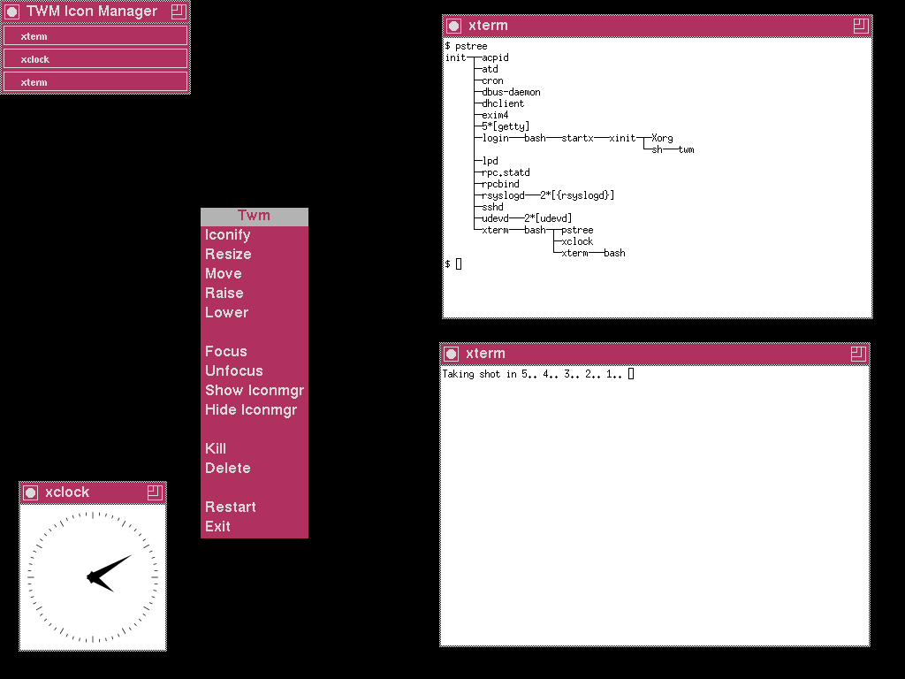
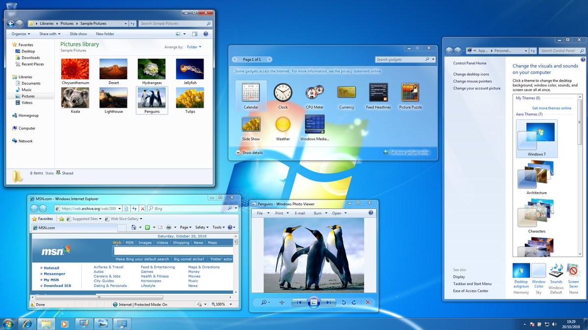

+++
title = "Introduction"
weight = 1
+++

## Introduction

La programmation graphique est le domaine de la programmation qui couvre toute chose affichée dans un écran par un ordinateur.

Un exemple et un des cas d'usage les plus fondamentaux de la théorie de ce domaine serait le *textual rendering* (L'affichage de texte). Imaginons le cas où nous souhaiterions créer notre propre système d'exploitation. Dans ce système d'exploitation, nous avons un kernel capable de contrôler la mémoire, l'I/O, d'utiliser des algorithmes de cryptographie, d'optimiser l'utilisation des ressources, etc. Cependant, nous souhaitons que nos clients puissent utiliser notre système d'exploitation à travers une invite de commande (tel le *TTY* de linux) ou alors même à travers une interface graphique (tel *xorg+twm* ou *DWM.exe+explorer.exe*). Pour cela nous allons devoir implémenter, dans notre kernel un système de logique graphique qui va contacter notre *hardware* et lui présenter les instructions qui vont lui permettre d'afficher à l'écran ce que l'on souhaite afficher.

### Exemples d'interfaces utilisateur

**Terminal TTY sous Linux**

**Interface graphique Xorg avec TWM**

**Desktop Window Manager avec explorer.exe sous Windows**

Dans cette situation, la personne en charge de cette partie du kernel se posera probablement des questions telles que : "*Comment ferait un kernel pour afficher un simple pixel sur l'écran ?*", "*Qu'est-ce qui transforme la lettre "A" en pixels visibles ?*", "*Comment le kernel choisit où placer le texte à l'écran ?*", "*Est-ce que je dois contrôler chaque pixel individuellement ?*", "*Quand l'écran peut afficher plusieurs résolutions, comment mon kernel doit-il s'adapter ?*". Les notes de cours qui vont suivre ont pour objectif de vous équipper des outils nécessaires pour vous aider a découvrir la réponse à ces questions.

---

Par Youssef Birji.
