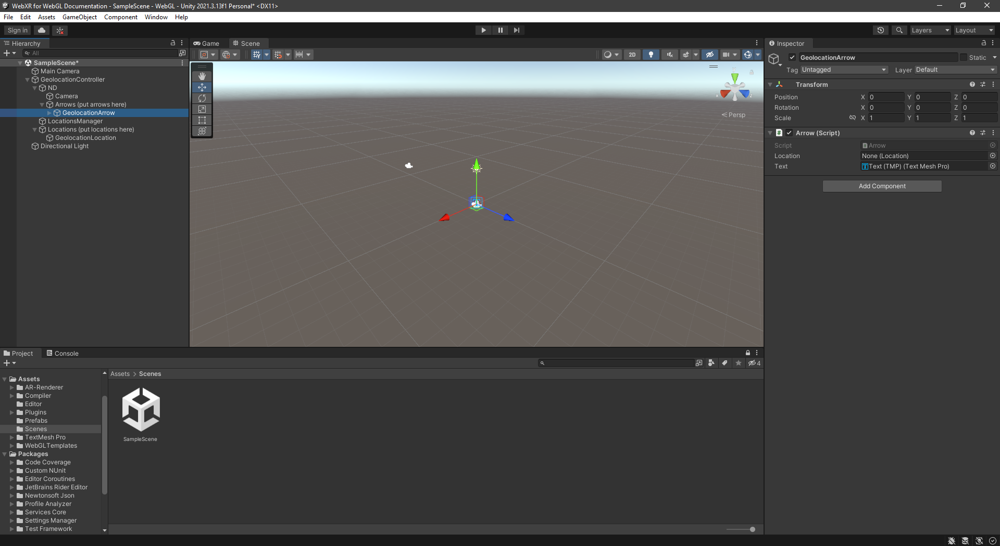
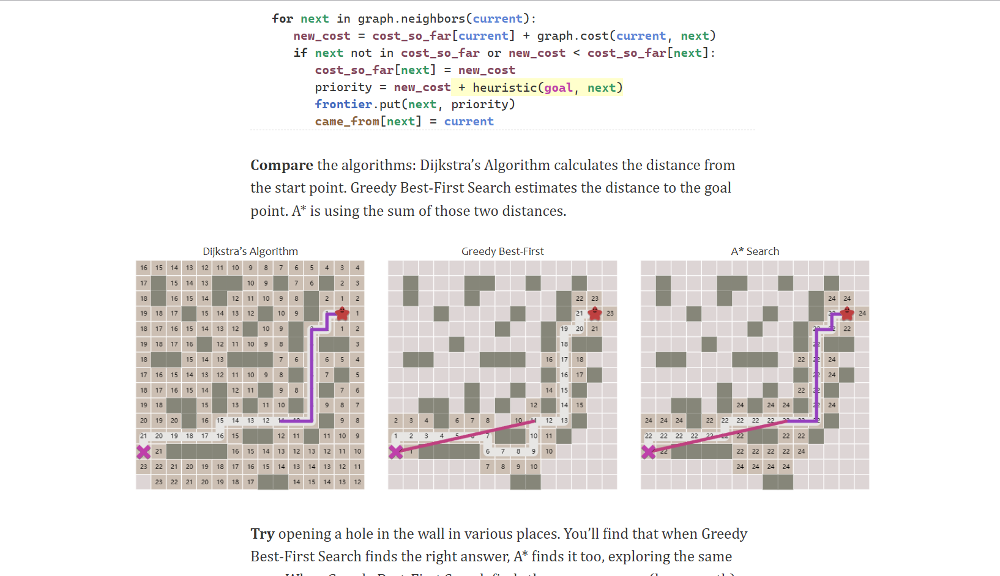
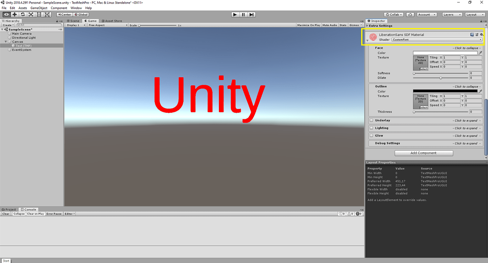

+++
title = "Notes de cours Unity"
weight = 50
+++

## MOTEUR DE JEU VIDÉO UNITY 


---

## 1. Introduction à Unity 

Les jeux vidéo représentent une forme de loisirs, d'art et de culture qui attire de plus en plus de fans à l'échelle mondiale. Ils sont le produit d'un mélange de plusieurs domaines, tels que la programmation, le design, le récit, le son, entre autres. Pour développer un jeu vidéo, un moteur est nécessaire ; ce logiciel est responsable de l'animation et du mouvement des éléments qui le composent. Il existe de nombreux moteurs de jeux vidéo disponibles, mais l'un d'eux se distingue par sa renommée et sa flexibilité : Unity.

Unity est un moteur de création de jeux vidéo qui permet de concevoir et de réaliser des jeux et des applications interactives pour divers types de plateformes et de réalités. Unity est le moteur de jeu vidéo le plus populaire et préféré par des millions de développeurs à travers le monde, grâce à une variété d'avantages et de fonctionnalités qui le rendent adapté à tous les types de projets, qu'ils soient simples ou complexes. Dans cet article, nous allons vous présenter Unity, expliquer son fonctionnement, décrire ce que vous pouvez réaliser avec, et analyser pourquoi il est le moteur de jeu vidéo essentiel pour donner vie à vos idées et aspirations.


### Fonctionnement de Unity

Unity agit comme un environnement de développement intégré qui fournit tous les outils nécessaires à la création de jeux et d'applications interactives. Unity repose sur le langage de programmation C, qui figure parmi les plus utilisés et les plus puissants à l'échelle mondiale. Avec Unity, il est possible de développer la logique, l'interface utilisateur, les graphismes, le son, la physique, l'intelligence artificielle ainsi que tous les éléments indispensables pour votre projet. En outre, Unity vous donne la possibilité d'importer et d'exporter des ressources, comme des modèles 3D, des textures, des animations, des sons, et bien d'autres, à partir de logiciels tels que Blender, Photoshop, Maya, et d'autres encore.

Avec Unity, il est possible de réaliser presque tout ce que vous pouvez imaginer, allant des jeux variés à des applications éducatives, de loisir, de santé, commerciales, etc. Unity se présente comme un moteur extrêmement adaptable et polyvalent, vous offrant la possibilité de développer des projets pour plusieurs systèmes, tels que Windows, Mac, Linux, Android, iOS, PlayStation, Xbox, Nintendo, Oculus, Steam et le Web. Il permet également de concevoir des projets pour divers types de réalités, incluant la réalité virtuelle, la réalité augmentée et la réalité mixte. Il est compatible avec les principaux dispositifs et systèmes de réalité, notamment Oculus Rift, HTC Vive, Microsoft HoloLens et Google Cardboard.


### Domaines d'utilisation

Le programme est soutenu par une vaste communauté d'utilisateurs et de développeurs qui échangent leurs savoirs, expériences, ressources, tutoriels, cours, etc., à travers plusieurs canaux tels que le forum officiel, le blog, la chaîne YouTube, et le réseau social Unity Connect. En outre, il propose une boutique en ligne nommée Asset Store, où il est possible de découvrir et d'acheter des milliers de ressources, telles que des modèles 3D, des textures, des effets sonores, des scripts, des animations, etc., conçues par d'autres utilisateurs et professionnels, que vous pouvez intégrer dans vos projets. Il présente également un service d'apprentissage appelé Unity Learn, permettant d'accéder à des cours, des projets, des leçons, de la documentation, etc., pour acquérir des connaissances sur Unity depuis le début ou pour perfectionner vos compétences.


## 2. Architecture d’un moteur de jeu

Unity précise que son moteur de base est principalement conçu en C et C++, mais qu'il met à disposition une couche en C que les développeurs emploient pour rédiger leurs scripts. La documentation souligne également que cette partie illustre la manière dont Unity intègre . NET, le fonctionnement de la compilation des scripts, la gestion de la mémoire ainsi que les distinctions entre les backends Mono et IL2CPP.

### La boucle de jeu (Game Loop)

Une boucle de jeu représente un cycle continu qui permet à un jeu de progresser en actualisant son état régulièrement. Elle est également responsable de l'analyse des actions des joueurs (tel qu'un bouton appuyé) et de la mise à jour des éléments du jeu ainsi que des interactions physiques. Affichage du jeu image par image.
Cette structure de boucle de jeu est une structure particulière dans Unity, qui dicte le fonctionnement du jeu. Ses méthodes principales incluent Start(), Update() et FixedUpdate(), qui contribuent toutes de manière unique à la boucle de jeu, et sont développées plus clairement ci-dessous.

### GameObjects & Components
Classe fondamentale pour tous les éléments pouvant exister dans une scène. Intégrez des composants à un GameObject afin de réguler son apparence et son comportement.
Le constitue le type d’objet essentiel dans Unity. Servez-vous de celui-ci pour symboliser tout ce qui figure dans votre projet, cela englobe les personnages, les accessoires et les environnements. Un fonctionne comme un réceptacle pour les composants qui contrôlent l’apparence et le comportement du GameObject.
Tout script qui hérite de MonoBehaviour peut être incorporé à un comme un composant. Utilisez la propriété Component. gameObject dans votre code pour accéder à l’objet auquel le composant est rattaché.

```C#
  using UnityEngine;

  public class Example_GameObject : MonoBehaviour
  {
      private void Start()
      {
          GameObject myExampleGO = new GameObject("myExampleGO", typeof(AudioSource));
      }
  }

```
### Prefabs
Dans Unity, les Prefabs sont utilisés comme des modèles prédéfinis. Ces Prefabs sont créés au sein de l'éditeur et sont stockés comme des ressources dans la fenêtre du projet. À partir de ces ressources Prefab, il est possible de générer une quantité illimitée d'éléments Prefab. Ces instances Prefab peuvent être soit construites à l'intérieur de l'éditeur et conservées dans vos scènes, soit reproduites pendant l'exécution du programme.

### Scènes et hiérarchie
Dans Unity, une scène est fondamentalement un espace qui englobe tous les éléments constitutifs de votre jeu, ou d'une partie spécifique de celui-ci. Considérez-la comme un espace délimité ou un niveau distinct. Chaque scène peut intégrer une variété d'objets, tels que des décors, des personnages, des sources d'éclairage, des caméras, ainsi que d'autres types d'objets de jeu.



---

## 3. Scripts C# dans Unity

Le scripting C# est la principale façon de programmer la logique de jeu dans Unity. Les scripts définissent comment les GameObjects se comportent, répondent aux entrées de l’utilisateur et interagissent entre eux. Comprendre le scripting C# est essentiel pour créer des jeux et des applications dynamiques et interactifs dans Unity.

### Structure d’un script

###### Création étape par étape :

Dans la fenêtre du projet, faites un clic droit → Créer → script C# → nommez-le « MyFirstScript »
<br> - Ouvrez le script : Double-cliquez sur le nouveau fichier de script pour l’ouvrir dans votre éditeur de code
<br> - Observez le modèle par défaut : Unity crée un script MonoBehaviour basique avec les méthodes Start et Update
<br> - Attacher à un GameObject : Glisser le script de la fenêtre du Projet vers un GameObject dans la hiérarchie


```C#
using UnityEngine;

public class MyFirstScript : MonoBehaviour
{
    // Start is called before the first frame update
    void Start()
    {
        // This code runs once when the GameObject is enabled
        Debug.Log("Script started!");  // Prints a message to the Console window
    }

    // Update is called once per frame
    void Update()
    {
        // This code runs every frame
        // Use for input handling, timer updates, and non-physics movement
    }
}
```               
<br> - UnityEngine : - Importe les fonctionnalités et classes principales de Unity
<br> - MyFirstScript : MonoBehaviour - Définit une classe qui hérite de MonoBehaviour
<br> - MonoBehaviour - La classe de base pour tous les scripts Unity qui s’attachent aux GameObjects
<br> - Start() - Méthode d’initialisation qui s’exécute une fois lorsque le script est activé
<br> - Update() - Méthode qui exécute chaque trame, utilisée pour des mises à jour régulières

###### Quand utiliser chaques méthodes :
<br> - Awake() : Pour la configuration initiale, les exécutions précédent toute méthode Start
<br> - Start() : Pour l’initialisation qui dépend d’autres composants
<br> - Update() : Pour le code dépendant des trames, gestion des entrées
<br> - FixedUpdate() : Pour les calculs physiques à des pas de temps fixes
<br> - LateUpdate() : Pour le code qui doit s’exécuter après toutes les mises à jour
<br> - OnEnable()/OnDisable() : Lorsque GameObject est activé/désactivé
<br> - OnDestroy() : Pour le nettoyage lorsque GameObject est détruit

---

## 4. Le moteur 2D
### Sprites et importation
Importer des images sous forme de sprites
Chargez des images dans l’éditeur Unity pour générer vos propres ressources en sprites.

Les sprites représentent un type de ressource que vous pouvez utiliser dans votre projet 2D sur Unity. Cette section explique comment charger des images en tant que sprites que vous pouvez intégrer dans votre projet 2D sur Unity. Cette section explique comment charger des images en tant que sprites.

Il existe deux méthodes principales pour ajouter des images à votre projet :

- Déposez les images directement dans le dossier Assets de votre projet.
- Ajoutez des images dans Unity grâce au menu de l’éditeur.
- Lorsque vous démarrez votre projet avec le modèle 2D ou que vous activez le mode 2D, Unity importe automatiquement les images en tant que texture de type Sprite (2D et UI). Si vous définissez votre projet en mode 3D, Unity les importera comme textures.

### Colliders 2D & Rigidbody2D
Un collisionneur en deux dimensions dans Unity est un élément qui établit la silhouette d'un GameObject pour les interactions physiques. Il facilite aux GameObjects la capacité de repérer et de réagir aux collisions tout en garantissant des performances améliorées pour les jeux en deux dimensions. Ces collisionneurs collaborent avec des Rigidbodies et des éléments Physics2D afin de reproduire une simulation physique authentique.

###### Types de collisionneurs 2D

BoxCollider2D
- Un simple collisionneur rectangulaire.
- Utile pour les plateformes, murs et objets en forme de boîte.

CircleCollider2D

- Un collisionneur circulaire avec un rayon.
- Idéal pour les objets arrondis comme les boules ou les roues.

CapsuleCollider2D

- Un collisionneur en forme de capsule aux extrémités arrondies.
- Ça fonctionne bien pour les collisions de personnages.

PolygonCollider2D

- Un collisionneur flexible qui prend la forme d’un sprite.
- Utile pour des objets complexes ou de formes irrégulières mais peut être coûteux en calcul.

EdgeCollider2D

- Un collisionneur à ligne qui ne limite pas une zone.
- Couramment utilisé pour le terrain et les limites ouvertes.

CompositeCollider2D

- Utilisé en conjonction avec d’autres collisionneurs pour fusionner plusieurs collisionneurs en un seul.
- Améliore les performances physiques en réduisant la complexité.
---

## 5. Animations

La partie animation sert à visionner les animations.
Il est possible d'attribuer des séquences d'animation à la partie animation et de gérer leur lecture via votre script. Le moteur d'animation de Unity repose sur des poids et permet le mélange des animations, les animations supplémentaires, le mixage des animations, les couches et le contrôle intégral de tous les éléments de la lecture.

### Animator Controller

Employez un contrôleur Animator pour structurer et maintenir un ensemble d'extraits d'animation ainsi que les transitions d'animation afférentes pour un personnage ou un GameObject animé.
Dans la majorité des cas, il est habituel d'avoir plusieurs animations et de passer d'une à l'autre en réponse à des conditions spécifiques du jeu. Par exemple, vous pourriez passer d'une animation de marche à un saut chaque fois que la touche espace est activée. Néanmoins, même si vous disposez d'un unique clip d'animation, il est essentiel de l'incorporer dans un contrôleur Animator pour pouvoir l'appliquer à un objet de jeu.
Le contrôleur Animator renferme des liens vers les clips d'animation qu'il exploite. Ce contrôleur gère les différents clips d'animation et les transitions entre eux à l'aide d'un automate fini, qui peut être considéré comme un diagramme représentant les clips d'animation et leurs transitions.
<br><br>


### États & Transitions

Les transitions entre machines à états sont là pour vous assister dans la simplification des grandes ou complexes machines à états. Elles offrent un niveau d'abstraction supérieur à celui de l'automate fini logique.
Chaque vue dans l’interface d’animation comprend un nœud d'entrée et un nœud de sortie. Ces nœuds sont employés lors des transitions entre les différentes machines à états.
Le nœud d'entrée est utilisé lorsque vous passez à une machine à états. Ce nœud sera évalué et se connectera à l'état de destination en fonction des conditions définies. Ainsi, le nœud d'entrée peut influencer l'état dans lequel débute la machine à états, en analysant les valeurs de vos paramètres au commencement de la machine à états.
Étant donné que les machines à états possèdent toujours un état par défaut, il y aura inévitablement une transition par défaut qui relie le nœud d’entrée à l’état par défaut.


---

## 6. Algorithmie appliquée à Unity

L’algorithme A est essentiel pour les déplacements dans les jeux vidéo, puisqu’il combine la précision de l’approche de Dijkstra avec l’efficacité d’une quête guidée par une estimation. Son mécanisme repose sur la formule f(n) = g(n) + h(n) : g représente le prix déjà payé, et h projette le trajet restant jusqu’à la cible. Cette évaluation permet à A de se concentrer sur les zones qui comptent vraiment, plutôt que d’examiner sans discernement toutes les possibilités comme le ferait Dijkstra. L’estimation utilisée, qu’elle provienne de la distance Manhattan, euclidienne ou octile, garantit de trouver la meilleure route à condition de ne jamais exagérer le tarif véritable. Pratiquement, A gère deux ensembles séparés : une liste ouverte regroupant les points à vérifier et une liste fermée contenant ceux qui ont déjà été examinés. Sa vélocité, sa robustesse et sa simplicité à employer dans des cadres en damier ou des structures NavMesh justifient son adoption fréquente pour les unités pilotées par IA en deux et trois dimensions. Des développements plus récents, comme la recherche JPS, HPA ou l’ajout de techniques d’aplanissement et de gestion des obstacles en temps réel, fournissent des mouvements encore plus aisés et crédibles dans les jeux actuels.



---

## 8. Interface utilisateur (UI)
### Canvas & RectTransform

La Toile constitue l'environnement où tous les éléments de l'interface utilisateur doivent se situer. Le Canvas représente un objet de jeu contenant un composant Canvas, et tous les éléments de l'interface utilisateur doivent être des sous-éléments de ce Canvas.
Lorsque vous générez un nouvel élément d'interface, comme une image par le biais du menu GameObject > UI > Image, cela crée automatiquement une Toile, à condition qu'il n'en existe pas déjà une dans la scène. L'élément d'interface est conçu comme un sous-élément de cette toile.
La superficie de la toile apparaît sous la forme d'un rectangle dans le Vue Scène. Cela rend le placement des éléments de l'interface plus simple sans nécessiter une vue de jeu constamment visible.

Les RectTransforms sont employés pour les interfaces utilisateur mais peuvent également être utilisés dans d'autres contextes. Ils servent à conserver et à ajuster la localisation, les dimensions et l'ancrage d'un rectangle, et prennent en charge différentes méthodes de mise à l'échelle dérivées d'un RectTransform parent.


Le Canvas se sert de l'objet EventSystem pour assister le système de messagerie.
### Boutons et textes

Employez l’élément Bouton afin de concevoir des boutons interactifs au sein d'une interface utilisateur. Par exemple, quand un usager clique ou touche un élément Bouton, cela provoque une action ou un événement, tel que l'ouverture d'une nouvelle fenêtre, l'envoi d'un formulaire ou la diffusion d'un son.

###### Créer un bouton

```C#
var button = new Button(() => { Debug.Log("Button clicked"); }) { text = "Click me" };
```
Le caractère distinctif du texte en tant qu'élément d'interface utilisateur est surtout attribuable à son dynamisme. Par exemple, pour afficher le score actuel du joueur à l’écran, il est nécessaire de transformer la valeur numérique du score en chaîne, souvent en utilisant la méthode . toString(), avant qu'elle ne soit présentée.
Pour ajouter un composant textuel d’interface, rendez-vous dans la Hiérarchie de Scène, 
<br>
sélectionnez créer → interface → texte.



---


{}
https://fr.creativosonline.org/Qu%27est-ce-que-Unity%2C-le-moteur-de-jeu-vid%C3%A9o-le-plus-populaire-et-le-plus-polyvalent-%3F.html
https://docs.unity3d.com/2022.3/Documentation/Manual/UnityArchitecture.html
https://docs.unity3d.com/2022.3/Documentation/Manual/UnityArchitecture.html
https://docs.unity3d.com/6000.0/Documentation/ScriptReference/GameObject.html
https://docs.unity3d.com/2023.2/Documentation//Manual/CreatingPrefabs.html
https://www.bob-le-developpeur.com/notions/scenes-unity
https://generalistprogrammer.com/tutorials/a-star-pathfinding-algorithm-complete-tutorial
https://voldedk.github.io/EasyLearn/csharp-scripting-unity.html
https://docs.unity3d.com/2022.3/Documentation/Manual/sprites-setup.html
https://studios.artanode.com/understanding-2d-colliders-in-unity/
https://docs.unity3d.com/2022.3/Documentation/ScriptReference/Animation.html
https://docs.unity3d.com/6000.0/Documentation/Manual/class-AnimatorController.html
https://docs.unity3d.com/6000.2/Documentation/Manual/StateMachineTransitions.html
https://docs.unity3d.com/2020.1/Documentation/Manual/UICanvas.html
https://docs.unity3d.com/6000.0/Documentation/ScriptReference/RectTransform.html
https://docs.unity3d.com/2022.3/Documentation//Manual/UIE-uxml-element-Button.html
https://www.tutorialspoint.com/unity/unity_text_element.htm
  
{}